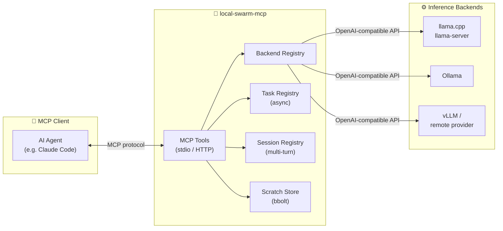
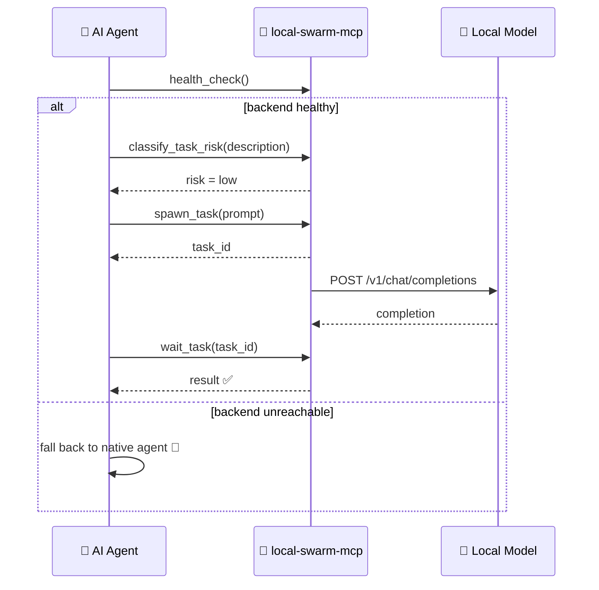

# 🐝 local-swarm-mcp

<p align="center">
  <a href="https://github.com/jhonsferg/local-swarm-mcp/actions/workflows/ci.yml"></a>
  <a href="https://github.com/jhonsferg/local-swarm-mcp/blob/main/LICENSE"></a>
  
  
  
</p>

<p align="center">
  
  
  
  
</p>

An MCP server that delegates mechanical, low-judgment tasks to local or
remote OpenAI-compatible inference backends (llama.cpp's `llama-server`,
Ollama, vLLM, or any hosted provider exposing the same API shape), and gives
an MCP client full control over that delegated work: fire-and-forget
background tasks, multi-turn sessions, a persistent scratch store, and
context-budgeting helpers - the same primitives an agent orchestration
system offers for its own subagents, backed by a model running on your own
hardware. 🖥️⚡

## 🧠 Why

Judgment-heavy work (architecture decisions, deciding whether a finding is a
false positive, writing meaningful tests) needs a strong model. Mechanical
work (boilerplate generation, log summarization, formatting, repetitive
transforms) doesn't. This server lets an MCP client offload the latter to
whatever hardware you already have running a local model, keeping its own
token budget for the former - and treat that offloaded work like its own
background agents rather than a single blocking request/response call. 💸

## 🗺️ Architecture



Every backend just speaks the OpenAI `/v1/chat/completions` + `/v1/models`
shape, so the server never hardcodes vLLM/llama.cpp/Ollama-specific logic.
Adding a new provider is a config-file edit, not a code change.

## 🤝 Expected client behavior: check availability, then prefer this over native agents

This server is meant to sit alongside, not replace, an MCP client's own
native agent/subagent capability.



1. **At the start of a task that could be delegated**, call `list_backends`
   and/or `health_check` to confirm at least one backend is actually
   reachable right now - a configured backend whose `llama-server`/Ollama
   process isn't running, or a remote HTTP transport instance that's
   offline, should not silently block work.
2. **If a backend is healthy**, prefer `spawn_task`/`create_session`
   over the client's own native subagent mechanism for mechanical,
   low-judgment work (use `classify_task_risk` first if unsure whether a
   task qualifies) - this is what actually saves tokens/cost, since the
   work runs on hardware you already own instead of the client's own paid
   model.
3. **If no backend is healthy**, fall back to the client's native agents
   for that work rather than failing the task - this server is a
   cost-saving optimization, not a hard dependency.

Nothing in the server enforces this - it's a client-side policy this
project is designed to support. See a specific client's own configuration
(rules file, memory, system prompt, etc.) for how it's told to apply it.

## ⚙️ Prerequisites

**1. An OpenAI-compatible inference backend, running somewhere reachable.**
local-swarm-mcp does not embed or bundle an inference engine itself - it's a
thin client in front of one. Pick whichever fits your hardware; both were
verified end-to-end against this server during development.

### 🦙 Ollama (easiest - recommended if you just want something working)

Ollama bundles model management and an OpenAI-compatible API, and
auto-detects your GPU backend (CUDA/ROCm/Metal/CPU) with no manual backend
selection.

**Windows:**
```powershell
winget install --id Ollama.Ollama -e
```
**macOS:** download from [ollama.com/download](https://ollama.com/download),
or `brew install ollama`.
**Linux:**
```bash
curl -fsSL https://ollama.com/install.sh | sh
```

Then pull a small model and start serving (Ollama also auto-starts as a
background service on Windows/macOS after install - `ollama serve` is only
needed if it isn't already running):
```
ollama pull qwen2.5-coder:1.5b   # ~1GB, comfortable on 4-6GB VRAM laptops
ollama serve                      # if not already running as a service
```
Verify it's up:
```
curl http://localhost:11434/v1/models
```
Ollama's OpenAI-compatible endpoint is `http://localhost:11434/v1`.

### 🔧 llama.cpp (better for mixed NVIDIA/AMD hardware)

More manual, but its Vulkan backend runs on both NVIDIA and AMD GPUs without
depending on ROCm's maturity - useful if you have, say, an NVIDIA laptop and
an AMD desktop and want one build that works on both.

```
# build from source (https://github.com/ggml-org/llama.cpp), or grab a
# release binary for your platform, then:
llama-server -m /path/to/model.gguf --host 0.0.0.0 --port 8080
```
Its OpenAI-compatible endpoint is `http://<host>:8080/v1`.

### 🌐 Anything else

**vLLM**, or any hosted provider with an OpenAI-compatible
`/v1/chat/completions` endpoint, also work - just point a backend entry
at it.

**2. Go 1.26 or newer**, to build local-swarm-mcp itself:
```
go build -o local-swarm-mcp ./cmd/local-swarm-mcp
```
(No prebuilt release binaries yet - this is a v0.1 project. If you add a
release workflow later, update this section.)

## 🛠️ Configuring backends

Backends can come from a config file, from command-line flags, or both (an
ad-hoc `-backend-url` is appended on top of whatever the config file
loaded). At least one backend must end up configured or the server refuses
to start.

### Option A: config file (YAML or JSON)

Format is auto-detected from the file extension (`.json` => JSON, anything
else => YAML); override with `-config-format`.

`config.yaml`:
```yaml
backends:
  - name: local-llama
    base_url: http://localhost:8080/v1
    model: qwen2.5-coder

  - name: local-ollama
    base_url: http://localhost:11434/v1
    model: qwen2.5-coder:7b

# Optional - defaults to <user cache dir>/local-swarm-mcp/scratch.db
store_path: C:\Users\you\.cache\local-swarm-mcp\scratch.db
```

Equivalent `config.json`:
```json
{
  "backends": [
    { "name": "local-llama", "base_url": "http://localhost:8080/v1", "model": "qwen2.5-coder" }
  ],
  "store_path": "C:\\Users\\you\\.cache\\local-swarm-mcp\\scratch.db"
}
```

Run with `-config path/to/config.yaml` (or `.json`). If `-config` is
omitted, the server looks for `<user config dir>/local-swarm-mcp/config.yaml`
(`%APPDATA%\local-swarm-mcp\config.yaml` on Windows,
`~/.config/local-swarm-mcp/config.yaml` on Linux/macOS) - if that file
doesn't exist either, a missing config is not an error on its own, as long
as `-backend-url` supplies at least one backend.

### Option B: flags only, no config file

```
local-swarm-mcp \
  -backend-name local-llama \
  -backend-url http://localhost:8080/v1 \
  -backend-model qwen2.5-coder
```

### All flags

| Flag | Default | Purpose |
|---|---|---|
| `-config` | `<user config dir>/local-swarm-mcp/config.yaml` | Path to a YAML or JSON config file |
| `-config-format` | auto-detect from `-config`'s extension | Force `"yaml"` or `"json"` parsing |
| `-backend-name` | `cli` | Name for the ad-hoc backend given via `-backend-url` |
| `-backend-url` | *(none)* | Base URL for an ad-hoc backend, added on top of any config-file backends |
| `-backend-model` | *(none)* | Model name for the ad-hoc backend |
| `-backend-key` | *(none)* | API key for the ad-hoc backend, if any |
| `-store-path` | config file's `store_path`, else `<user cache dir>/local-swarm-mcp/scratch.db` | Override the scratch-store file location |
| `-transport` | `stdio` | `"stdio"` (spawned as a local subprocess) or `"http"` (a standalone network service) |
| `-http-addr` | `:8090` | Listen address when `-transport=http`, e.g. `:8090` or `0.0.0.0:8090` |
| `-api-key` | *(none)* | Bearer token HTTP clients must present when `-transport=http`; required unless `-insecure-no-auth` is set |
| `-insecure-no-auth` | `false` | Allow `-transport=http` with no `-api-key` - only on a trusted, isolated network |

## 🔌 Registering with an MCP client

### 💻 Local (stdio) - the common case

Add an entry to your client's MCP config (e.g. Claude Code's `.mcp.json`)
pointing `command` at the built binary, with any flags you need in `args`:

```json
{
  "mcpServers": {
    "local-swarm-mcp": {
      "command": "/path/to/local-swarm-mcp",
      "args": ["-config", "/path/to/config.yaml"]
    }
  }
}
```

### 🌍 Remote (HTTP) - running on a separate GPU machine

If your inference hardware lives on a different machine than your MCP
client (e.g. a DGX Spark, or any other PC with a GPU on your network), run
local-swarm-mcp *there* instead, with its backends pointed at that
machine's own local inference server:

```
local-swarm-mcp -transport http -http-addr 0.0.0.0:8090 -api-key <a-strong-random-token> -config /path/to/config.yaml
```

Then point your MCP client at it over HTTP (exact config syntax depends on
your client - check whether it supports a `url` + `headers` style MCP
entry, e.g.):

```json
{
  "mcpServers": {
    "local-swarm-mcp": {
      "url": "http://gpu-host:8090/mcp",
      "headers": { "Authorization": "Bearer <a-strong-random-token>" }
    }
  }
}
```

🔒 `-api-key` is required unless you pass `-insecure-no-auth` - anyone who
can reach the port can otherwise spawn tasks and read/write the scratch
store, so treat it like any other network-exposed service.
`-insecure-no-auth` is only reasonable on a network you fully trust and
isolate (e.g. a home LAN with no other untrusted devices).

## 🧰 Tools

### 🔗 Backends
| Tool | Purpose |
|---|---|
| `list_backends` | List configured backends (name, base_url, model) |
| `health_check` | Probe reachability of one backend, or all if omitted |

### ⚡ One-shot delegation
| Tool | Purpose |
|---|---|
| `delegate_task` | Send a task to a backend and block for the completion - the simple synchronous path |
| `compact_context` | Summarize a block of text down to a target size via a backend, so it doesn't sit uncompacted in the client's own context |

### 🎯 Background tasks (fire-and-forget, like spawning a subagent)
| Tool | Purpose |
|---|---|
| `spawn_task` | Start a task in the background, return a task ID immediately |
| `task_status` | Non-blocking snapshot of a task's state (pending/running/completed/failed/cancelled) |
| `wait_task` | Block until a task finishes or a timeout elapses, then return its final snapshot |
| `list_tasks` | List every task spawned this server run |
| `cancel_task` | Cancel a still-running task |

### 💬 Sessions (persistent multi-turn conversations, like resuming a named agent)
| Tool | Purpose |
|---|---|
| `create_session` | Open a session against a backend with an optional system prompt |
| `send_message` | Send a message within a session, carrying its full prior history, and get the reply |
| `session_history` | Return a session's full message history |
| `close_session` | Discard a session |
| `list_sessions` | List every open session with its backend and message count |

### 🗄️ Scratch store (persistent key-value space outside the client's context)
| Tool | Purpose |
|---|---|
| `scratch_set` | Store a value under a key |
| `scratch_get` | Retrieve a value by key |
| `scratch_list` | List all stored keys |
| `scratch_delete` | Delete a key |

### 📊 Context budgeting
| Tool | Purpose |
|---|---|
| `estimate_tokens` | Rough heuristic token count for a block of text, to decide whether `compact_context` is worth calling |
| `classify_task_risk` | Fast rule-based check (no model call) flagging whether a task description looks unsafe to delegate (destructive git/DB operations, secrets, architecture decisions) - not authoritative, just a fast first pass |

## 🧪 Development

```
go build ./...
go vet ./...
go test ./... -race -covermode=atomic
```

`-race` requires cgo (`CGO_ENABLED=1`); on a machine without a C toolchain,
drop `-race` for local runs - CI still runs it on all three OSes.

## 📌 Status

v0.1 - core delegation, task orchestration, sessions, and context tools are
in place. Verified end-to-end over stdio against a real Ollama backend
(`qwen2.5-coder:1.5b`) on a 6GB-VRAM laptop GPU: all 20 tools registered and
responded correctly, including a full spawn/wait task round-trip and a
multi-turn session.

## 📄 License

MIT - see [LICENSE](LICENSE).
