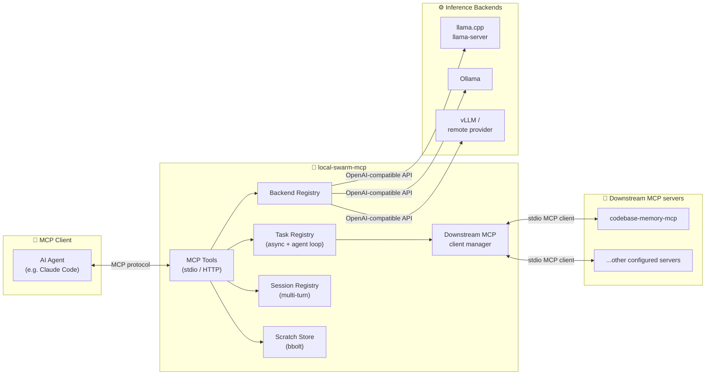
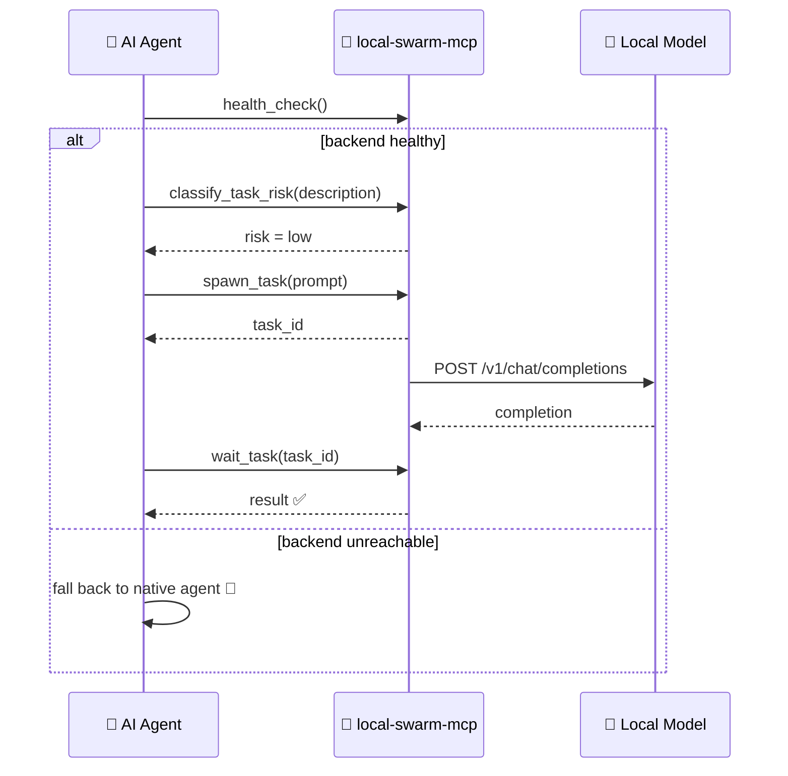

# 🐝 local-swarm-mcp

<p align="center">
  <a href="https://github.com/jhonsferg/local-swarm-mcp/actions/workflows/ci.yml"></a>
  <a href="https://github.com/jhonsferg/local-swarm-mcp/blob/main/LICENSE"></a>
  
  
  
</p>

<p align="center">
  
  
  
  
</p>

<p align="center">
  
  
  
</p>

An MCP server that delegates mechanical, low-judgment tasks to local or
remote OpenAI-compatible inference backends (llama.cpp's `llama-server`,
Ollama, vLLM, or any hosted provider exposing the same API shape), and gives
an MCP client full control over that delegated work: fire-and-forget
background tasks, multi-turn sessions, a persistent scratch store, and
context-budgeting helpers - the same primitives an agent orchestration
system offers for its own subagents, backed by a model running on your own
hardware. 🖥️⚡

## 🧠 Why

Judgment-heavy work (architecture decisions, deciding whether a finding is a
false positive, writing meaningful tests) needs a strong model. Mechanical
work (boilerplate generation, log summarization, formatting, repetitive
transforms) doesn't. This server lets an MCP client offload the latter to
whatever hardware you already have running a local model, keeping its own
token budget for the former - and treat that offloaded work like its own
background agents rather than a single blocking request/response call. 💸

## 🗺️ Architecture



Every backend just speaks the OpenAI `/v1/chat/completions` + `/v1/models`
shape, so the server never hardcodes vLLM/llama.cpp/Ollama-specific logic.
Adding a new provider is a config-file edit, not a code change. The downstream
MCP client manager lets a `spawn_agent_task` agent call other MCP servers'
tools autonomously, in a loop, the same way a host application calls its
own tools - see [Tool-using agents](#-tool-using-agents-autonomous-like-a-host-applications-own-agents).

## 🤝 Expected client behavior: check availability, then prefer this over native agents

This server is meant to sit alongside, not replace, an MCP client's own
native agent/subagent capability.



1. **At the start of a task that could be delegated**, call `list_backends`
   and/or `health_check` to confirm at least one backend is actually
   reachable right now - a configured backend whose `llama-server`/Ollama
   process isn't running, or a remote HTTP transport instance that's
   offline, should not silently block work.
2. **If a backend is healthy**, prefer `spawn_task`/`create_session`
   over the client's own native subagent mechanism for mechanical,
   low-judgment work (use `classify_task_risk` first if unsure whether a
   task qualifies) - this is what actually saves tokens/cost, since the
   work runs on hardware you already own instead of the client's own paid
   model.
3. **If no backend is healthy**, fall back to the client's native agents
   for that work rather than failing the task - this server is a
   cost-saving optimization, not a hard dependency.

Nothing in the server enforces this - it's a client-side policy this
project is designed to support. See a specific client's own configuration
(rules file, memory, system prompt, etc.) for how it's told to apply it.

## ⚙️ Prerequisites

**1. An OpenAI-compatible inference backend, running somewhere reachable.**
local-swarm-mcp does not embed or bundle an inference engine itself - it's a
thin client in front of one. Pick whichever fits your hardware; both were
verified end-to-end against this server during development.

### 🦙 Ollama (easiest - recommended if you just want something working)

Ollama bundles model management and an OpenAI-compatible API, and
auto-detects your GPU backend (CUDA/ROCm/Metal/CPU) with no manual backend
selection.

**Windows:**
```powershell
winget install --id Ollama.Ollama -e
```
**macOS:** download from [ollama.com/download](https://ollama.com/download),
or `brew install ollama`.
**Linux:**
```bash
curl -fsSL https://ollama.com/install.sh | sh
```

Then pull a small model and start serving (Ollama also auto-starts as a
background service on Windows/macOS after install - `ollama serve` is only
needed if it isn't already running):
```
ollama pull qwen2.5-coder:1.5b   # ~1GB, comfortable on 4-6GB VRAM laptops
ollama serve                      # if not already running as a service
```
Verify it's up:
```
curl http://localhost:11434/v1/models
```
Ollama's OpenAI-compatible endpoint is `http://localhost:11434/v1`.

### 🔧 llama.cpp (better for mixed NVIDIA/AMD hardware)

More manual, but its Vulkan backend runs on both NVIDIA and AMD GPUs without
depending on ROCm's maturity - useful if you have, say, an NVIDIA laptop and
an AMD desktop and want one build that works on both.

```
# build from source (https://github.com/ggml-org/llama.cpp), or grab a
# release binary for your platform, then:
llama-server -m /path/to/model.gguf --host 0.0.0.0 --port 8080
```
Its OpenAI-compatible endpoint is `http://<host>:8080/v1`.

### 🌐 Anything else

**vLLM**, or any hosted provider with an OpenAI-compatible
`/v1/chat/completions` endpoint, also work - just point a backend entry
at it.

**2. local-swarm-mcp itself** - either grab a release binary or build from
source. See [Installing](#-installing) below.

## 📦 Installing

### Linux / macOS

```sh
curl -fsSL https://raw.githubusercontent.com/jhonsferg/local-swarm-mcp/main/install/install.sh | sh
```

### Windows

```powershell
irm https://raw.githubusercontent.com/jhonsferg/local-swarm-mcp/main/install/install.ps1 | iex
```

Both scripts detect your OS/arch, download the matching release archive
and its `checksums.txt`, verify the SHA-256 checksum, and install
`local-swarm-mcp` (`.exe` on Windows) to `~/.local/bin` (Linux/macOS) or
`%USERPROFILE%\.local\bin` (Windows). Set `LSM_INSTALL_DIR`/`LSM_VERSION`
(`$env:LSM_INSTALL_DIR`/`$env:LSM_VERSION` on Windows) before piping to
override the install location or pin a specific version instead of
`latest`.

Releases are built by [goreleaser](https://goreleaser.com) for
`{linux,darwin,windows} x {amd64,arm64}` and published automatically on
every merge to `main` whose commits since the last tag warrant a version
bump (Conventional Commits: `feat:` -> minor, `fix:`/`perf:`/`refactor:`
-> patch, `feat!:`/`BREAKING CHANGE` -> major). See [releases](https://github.com/jhonsferg/local-swarm-mcp/releases).

### From source

```sh
go build -o local-swarm-mcp ./cmd/local-swarm-mcp
```
Requires Go 1.26 or newer.

## 🛠️ Configuring backends

There's no config file to maintain: run as the persistent daemon and add
backends via the CLI or the web UI, both of which take effect immediately
with no restart.

```sh
# Start the daemon once, with the dashboard on
local-swarm-mcp -transport http -insecure-no-auth -ui

# Then, from the CLI (a separate terminal, or a script) - or from the
# dashboard's "Register host" form instead:
local-swarm-mcp -register-host -name local-llama -host-base-url http://localhost:11434
```

`-register-host` either talks to the daemon you just started (if one's
already running at `-http-addr`) or, if none is running yet, becomes the
daemon itself - see [Host discovery](#-host-discovery---add-inference-hardware-without-editing-config-or-restarting)
below for the full mechanics. A single ad-hoc backend from flags alone
(no daemon, no registration) still works too, e.g. for a quick one-off
`-transport stdio` run:

```
local-swarm-mcp -backend-name local-llama -backend-url http://localhost:8080/v1 -backend-model qwen2.5-coder
```

### Flags that matter most

| Flag | Default | Purpose |
|---|---|---|
| `-transport` | `stdio` | `"stdio"` (spawned as a local subprocess) or `"http"` (the persistent daemon) |
| `-ui` | `false` | Serve the embedded dashboard at `/` - only meaningful for `-transport=http` |
| `-http-addr` | `:8090` | Listen address when `-transport=http`, e.g. `:8090` or `0.0.0.0:8090` |
| `-api-key` | *(none)* | Bearer token HTTP clients must present when `-transport=http`; required unless `-insecure-no-auth` is set |
| `-insecure-no-auth` | `false` | Allow `-transport=http` with no `-api-key` - only on a trusted, isolated network |
| `-register-host` | `false` | Register an inference host for background discovery - see `-name`/`-host-base-url`/`-host-api-key` |
| `-backend-name`/`-backend-url`/`-backend-model`/`-backend-key` | *(none)* | A single ad-hoc backend, for a quick run without the daemon |
| `-store-path` | `<user cache dir>/local-swarm-mcp/scratch.db` | Override the scratch-store file location |

Run `local-swarm-mcp -h` for the full, grouped flag reference (host
discovery, downstream MCP servers, storage locations, and more).

<details>
<summary>Legacy: YAML/JSON config file</summary>

A `-config path/to/config.yaml` (or `.json`) file with `backends:` and
`mcp_servers:` lists still works and is still auto-detected at
`<user config dir>/local-swarm-mcp/config.yaml` if present - this predates
host discovery and dynamic downstream MCP server registration, and is no
longer the recommended way to configure anything covered by those
features. It remains useful for exactly one thing: a fixed, version-
controllable starting point loaded once at daemon startup (or for a
`-transport stdio` run where a persistent daemon isn't wanted at all).

```yaml
backends:
  - name: local-llama
    base_url: http://localhost:8080/v1
    model: qwen2.5-coder
mcp_servers:
  - name: codebase-memory-mcp
    command: /path/to/codebase-memory-mcp
store_path: C:\Users\you\.cache\local-swarm-mcp\scratch.db
```

⚠️ **This file auto-loads even if you never pass `-config`** - the flag's
*default value* is that same `<user config dir>` path, so if it exists
from an earlier setup, its `backends:` list gets loaded every time and
sits alongside anything registered dynamically, permanently, since a
static entry is never touched by the discovery poller (it isn't the
poller's to manage). If you've moved to host discovery and still see an
old model that no longer exists on some host, this file - not a bug in
discovery - is almost certainly why: either delete it, or empty out its
`backends:` list, and restart the daemon.
</details>

## 🔌 Registering with an MCP client

### 💻 Local (stdio) - the common case

Add an entry to your client's MCP config (e.g. Claude Code's `.mcp.json`)
pointing `command` at the built binary:

```json
{
  "mcpServers": {
    "local-swarm-mcp": {
      "command": "/path/to/local-swarm-mcp"
    }
  }
}
```

Keep this path **unversioned** (`local-swarm-mcp`, not
`local-swarm-mcp-v2`): rebuilding to the same fixed path means your
client's config never needs to change and you never need to restart it
just to pick up a new build. Windows won't let you overwrite a `.exe`
its own running process has open, but it *will* let you rename one out
of the way first - so on Windows, rebuild like this instead of building
straight over it:

```powershell
Rename-Item local-swarm-mcp.exe local-swarm-mcp.exe.old -ErrorAction SilentlyContinue
go build -o local-swarm-mcp.exe ./cmd/local-swarm-mcp
```

The already-running process keeps working fine off the renamed file
(Windows processes hold an open handle, not a path) until it's next
restarted, at which point it picks up the new build from the same
stable path - no config edit required.

### 🌍 Remote (HTTP) - running on a separate GPU machine

If your inference hardware lives on a different machine than your MCP
client (e.g. a DGX Spark, or any other PC with a GPU on your network), run
local-swarm-mcp *there* instead, then register that machine's own local
inference server as a host once it's up (from another machine, or from
the dashboard):

```
local-swarm-mcp -transport http -http-addr 0.0.0.0:8090 -api-key <a-strong-random-token> -ui
```

Then point your MCP client at it over HTTP (exact config syntax depends on
your client - check whether it supports a `url` + `headers` style MCP
entry, e.g.):

```json
{
  "mcpServers": {
    "local-swarm-mcp": {
      "url": "http://gpu-host:8090/mcp",
      "headers": { "Authorization": "Bearer <a-strong-random-token>" }
    }
  }
}
```

🔒 `-api-key` is required unless you pass `-insecure-no-auth` - anyone who
can reach the port can otherwise spawn tasks and read/write the scratch
store, so treat it like any other network-exposed service.
`-insecure-no-auth` is only reasonable on a network you fully trust and
isolate (e.g. a home LAN with no other untrusted devices).

### 🛰️ Host discovery - add inference hardware without editing config or restarting

Once running with `-transport http`, local-swarm-mcp becomes a small
service-discovery daemon for your inference hosts: register a host once
(a desktop GPU, a DGX Spark, an AMD AI box - anything speaking Ollama's
API) and it's polled in the background forever after. New models pulled
on that host show up automatically as `<host>/<model>` backends - no
YAML/JSON edit, no client restart.

```
local-swarm-mcp -register-host -name rx9070 -host-base-url http://192.168.18.29:11434
```

- If a daemon is already running at the default address, this is a thin
  HTTP client: it forwards the registration and exits.
- If no daemon is running yet, this invocation *becomes* the daemon (same
  process, same leader-election mechanism `-transport http` normally goes
  through) and keeps the registration.

Exactly one process ever wins: every invocation probes `-http-addr` first,
and if nothing answers there, falls back to a PID lockfile
(`<user cache dir>/local-swarm-mcp/daemon.lock`) with a health check as a
second, independent confirmation - a stale lock from a crashed daemon is
reclaimed automatically (its PID is checked for liveness), but a live PID
that isn't actually answering as a real local-swarm-mcp daemon is
reported as a genuine conflict rather than silently overridden.

The same operations are also available as MCP tools
(`register_backend_host`, `unregister_backend_host`,
`list_backend_hosts`) so an agent - or you, through your MCP client - can
manage hosts directly over the existing connection. `list_backend_hosts`
reports whether each host is currently reachable (`up`), so you (or an
agent orchestrating work) can tell a host that's merely registered but
powered off from one that's actually available before dispatching a task
to it.

### 🔌 Downstream MCP servers, dynamically

The `mcp_servers:` config-file list works the same way it always has, but
it's legacy now: `register_downstream_mcp_server` (and its
`unregister_downstream_mcp_server` / `list_downstream_mcp_servers`
counterparts) registers a server like `codebase-memory-mcp` at runtime -
spawned and connected immediately, persisted so it reconnects
automatically across daemon restarts, no config file or restart needed.
The same three operations are also exposed over the admin HTTP surface
(`POST /admin/register-mcp-server`, `POST /admin/unregister-mcp-server`,
`GET /admin/mcp-servers`) and from the embedded dashboard below.

## 📊 Dashboard

```
local-swarm-mcp -transport http -insecure-no-auth -ui
```

`-ui` serves an embedded dashboard at `/` (a small Vue app - see
[`ui/`](ui/)) showing configured backends, registered inference hosts
with live up/down status and discovered models, registered downstream
MCP servers with live connected/disconnected status, and a live-streaming
log tail. Everything on the page is a thin client over the same
`/admin/*` endpoints described above - you can register or edit a host,
register a downstream MCP server, or watch what the daemon is doing in
real time, all without touching a config file or a terminal.

## 🧰 Tools

### 🔗 Backends
| Tool | Purpose |
|---|---|
| `list_backends` | List configured backends (name, base_url, model) |
| `health_check` | Probe reachability of one backend, or all if omitted |

### 🛰️ Host discovery (only when running with `-transport http`)
| Tool | Purpose |
|---|---|
| `register_backend_host` | Register a new inference host for background model discovery |
| `unregister_backend_host` | Remove a registered host and stop polling it |
| `list_backend_hosts` | List registered hosts, whether each is currently reachable, and the models discovered on it |

### 🔌 Downstream MCP servers (only when running with `-transport http`)
| Tool | Purpose |
|---|---|
| `register_downstream_mcp_server` | Register and connect a downstream MCP server (e.g. codebase-memory-mcp) at runtime |
| `unregister_downstream_mcp_server` | Disconnect and remove a registered downstream MCP server |
| `list_downstream_mcp_servers` | List registered downstream servers and whether each is currently connected |

### ⚡ One-shot delegation
| Tool | Purpose |
|---|---|
| `delegate_task` | Send a task to a backend and block for the completion - the simple synchronous path |
| `compact_context` | Summarize a block of text down to a target size via a backend, so it doesn't sit uncompacted in the client's own context |

### 🎯 Background tasks (fire-and-forget, like spawning a subagent)
| Tool | Purpose |
|---|---|
| `spawn_task` | Start a task in the background, return a task ID immediately |
| `task_status` | Non-blocking snapshot of a task's state (pending/running/completed/failed/cancelled) |
| `wait_task` | Block until a task finishes or a timeout elapses, then return its final snapshot |
| `list_tasks` | List every task spawned this server run |
| `cancel_task` | Cancel a still-running task |

### 🧑‍🔧 Tool-using agents (autonomous, like a host application's own agents)
| Tool | Purpose |
|---|---|
| `spawn_agent_task` | Start a background agent that can call tools from configured downstream MCP servers (`mcp_servers` in config) in a loop before answering, tracked via the same `task_status`/`wait_task`/`list_tasks`/`cancel_task` tools above. The result includes a full transcript of every tool call made, for auditing. |
| `list_available_agent_tools` | List every tool discovered from configured downstream MCP servers (namespaced `<server>__<tool>`) that an agent could invoke |

⚠️ **Requires a tool-calling-capable model.** Not every model that claims
"tools" support actually produces a real structured `tool_calls` response.
Verified on this project:

| Model | Real `tool_calls`? |
|---|---|
| `llama3.1:8b` (Ollama) | ✅ Yes |
| `qwen2.5-coder:7b` (Ollama) | ❌ No - prints tool-call-shaped JSON as plain text |
| `qwen2.5-coder:1.5b` (Ollama) | ❌ No - same failure mode |

Test a new model with a trivial tool schema before relying on it for
`spawn_agent_task` - a model that fails silently prints its "call" as text
and the loop just treats it as (probably wrong) final output.

Example config wiring `codebase-memory-mcp` (installed earlier, see its own
docs) as a downstream server:
```yaml
backends:
  - name: agent-model
    base_url: http://localhost:11434/v1
    model: llama3.1:8b

mcp_servers:
  - name: codebase-memory-mcp
    command: /path/to/codebase-memory-mcp
```

🔒 Downstream tool access is opt-in and configured per server; `codebase-memory-mcp`
is a good reference integration because its tools are read-only (indexing
and querying, no writes). Think carefully before pointing an agent task at
a downstream server with write/destructive tools - the model driving it may
be far less reliable than the client that configured it.

### 💬 Sessions (persistent multi-turn conversations, like resuming a named agent)
| Tool | Purpose |
|---|---|
| `create_session` | Open a session against a backend with an optional system prompt |
| `send_message` | Send a message within a session, carrying its full prior history, and get the reply |
| `session_history` | Return a session's full message history |
| `close_session` | Discard a session |
| `list_sessions` | List every open session with its backend and message count |

### 🗄️ Scratch store (persistent key-value space outside the client's context)
| Tool | Purpose |
|---|---|
| `scratch_set` | Store a value under a key |
| `scratch_get` | Retrieve a value by key |
| `scratch_list` | List all stored keys |
| `scratch_delete` | Delete a key |

### 📊 Context budgeting
| Tool | Purpose |
|---|---|
| `estimate_tokens` | Rough heuristic token count for a block of text, to decide whether `compact_context` is worth calling |
| `classify_task_risk` | Fast rule-based check (no model call) flagging whether a task description looks unsafe to delegate (destructive git/DB operations, secrets, architecture decisions) - not authoritative, just a fast first pass |

## 🧪 Development

```
go build ./...
go vet ./...
go test ./... -race -covermode=atomic
```

`-race` requires cgo (`CGO_ENABLED=1`); on a machine without a C toolchain,
drop `-race` for local runs - CI still runs it on all three OSes.

### Building the dashboard (`ui/`)

The embedded dashboard is a separate Vue 3 + TypeScript + Tailwind
project at [`ui/`](ui/), kept independent from the Go server so each side
has its own fast test loop (`vitest` for UI components, `go test` for the
server) instead of one slow, tangled one.

```
cd ui
npm install
npm run test     # vitest, component-level
npm run build    # type-checks (vue-tsc) then builds straight into
                  # ../internal/webui/dist, which cmd/local-swarm-mcp
                  # embeds via go:embed
```

A minimal placeholder is committed at `internal/webui/dist` so a bare
`go build ./...` never breaks on a fresh clone without Node installed -
CI and goreleaser always run the real `npm run build` first (see the
`ui` job in `.github/workflows/ci.yml` and the `before.hooks` in
`.goreleaser.yml`), so release and CI-tested binaries always ship the
actual dashboard, never that placeholder. If you edit anything under
`ui/src`, run `npm run build` and commit the resulting change under
`internal/webui/dist` too, so the placeholder stays reasonably fresh for
everyone else's bare `go build`.

For local frontend development against a running daemon, `npm run dev`
starts Vite's dev server with `/admin` proxied to `http://localhost:8090`
(see `ui/vite.config.ts`) - point it at a different `-http-addr` by
editing that proxy target.

## 📌 Status

v0.5 - core delegation, task orchestration, sessions, context tools,
tool-using agents, a release pipeline, multi-host inference discovery,
dynamic downstream MCP server registration, structured logging, and an
embedded dashboard are all in place. Verified end-to-end over stdio and
HTTP against real Ollama backends across two machines (a 6GB-VRAM laptop
GPU and a 16GB-VRAM desktop GPU on the same LAN):
- v0.1: all 20 tools registered and responded correctly against `qwen2.5-coder:1.5b`,
  including a full spawn/wait task round-trip and a multi-turn session.
- v0.2: a `spawn_agent_task` run against `llama3.1:8b`, with `codebase-memory-mcp`
  wired in as a downstream server, correctly called `index_repository` on
  this repo and reported the real result (288 nodes, 937 edges) rather than
  a hallucinated one, with the tool call recorded in the task's transcript.
- v0.3: an auto-release pipeline (Conventional Commits bump detection,
  goreleaser) and one-line install scripts for Linux/macOS and Windows,
  both verified against real goreleaser-produced archives and checksums.
- v0.4: `-register-host` against a real remote Ollama instance - both the
  client path (an existing daemon forwards the registration) and the
  daemon-election path (no daemon running yet, the invocation becomes
  one) verified live; the background poller correctly discovered a
  freshly-pulled model (`gemma4:12b`) on that host and made it callable
  as `rx9070/gemma4:12b` without any config edit or restart.
- v0.5: `-ui` verified live against a real daemon and a real remote host -
  registering, editing, and removing a host and a downstream MCP server
  from the dashboard all worked end-to-end through the `/admin/*`
  endpoints, live log streaming (SSE) showed each action as it happened,
  and a `goreleaser build --snapshot` produced a release binary that
  served the real (non-placeholder) dashboard, confirming the whole
  `ui/` → `internal/webui/dist` → `go:embed` pipeline works outside CI too.

## 📄 License

MIT - see [LICENSE](LICENSE).
